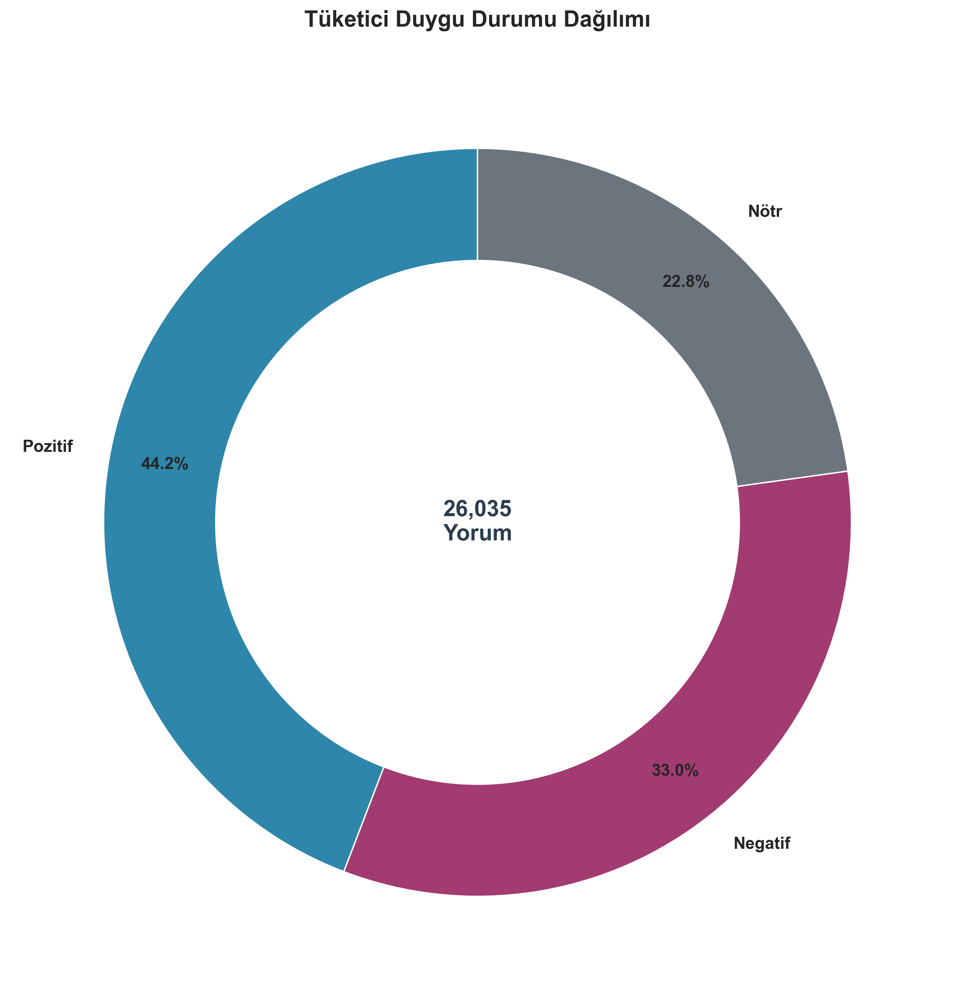
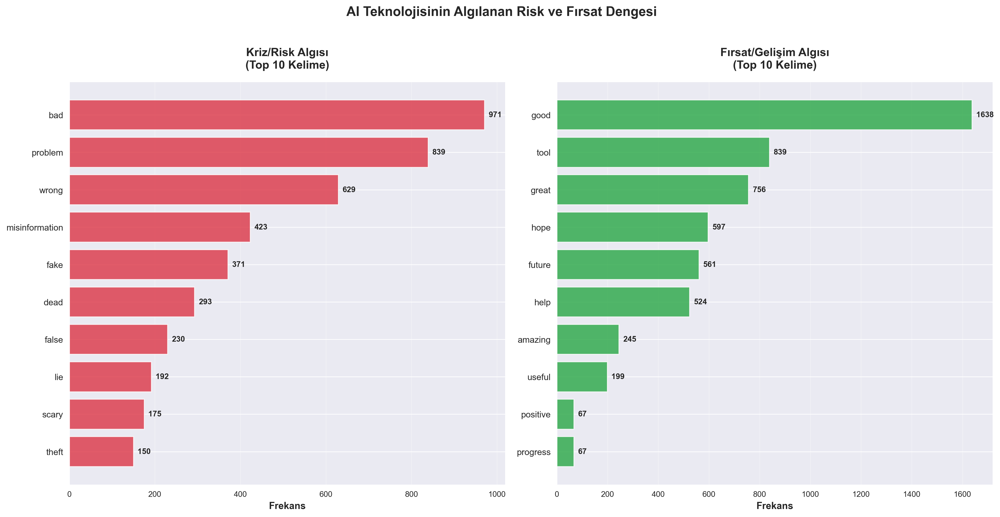
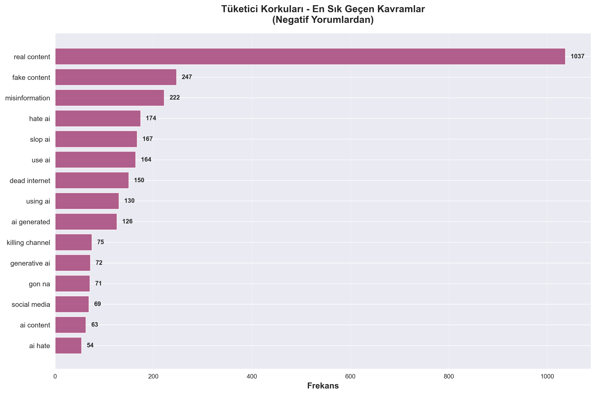
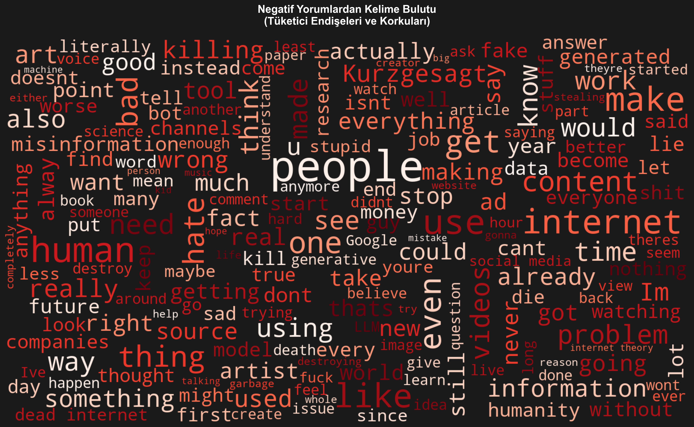

# YOUTUBE YORUMLARI İLE "AI SLOP" (YAPAY ZEKA ÇÖPLÜĞÜ) ALGI ANALİZİ RAPORU

**Veri Seti:** 26,035 YouTube Yorumu  
**Analiz Metodolojisi:** Sentiment Analysis, Topic Modeling (LDA), Contextual Word Analysis

---

## 1. YÖNETİCİ ÖZETİ VE ATMOSFER ANALİZİ

### Genel Pazar Atmosferi

26,035 tüketici içgörüsünün analizi, dijital içerik ekosisteminde karmaşık bir psikolojik durumu ortaya koymaktadır. Sentiment analizi sonuçlarına göre, pozitif içgörüler %44.18 oranında öne çıkmakta, ancak negatif içgörülerin %33.01'lik payı ve yoğunluğu, toplumda bir kırılma noktasına işaret etmektedir [cite: 8,593 negatif yorum].

Bu veri, yüzeysel bir "güven" atmosferi görüntüsü sunsa da, derinlemesine analiz, tüketicilerin AI teknolojisine karşı temkinli bir yaklaşım sergilediğini göstermektedir. Nötr içgörülerin %22.81'lik payı, önemli bir tüketici kitlesinin henüz karar verme aşamasında olduğunu ve bu belirsizliğin markalar için hem risk hem de fırsat barındırdığını göstermektedir.

**Gerçek Tüketici İçgörüleri:**

> *"I hate what youtube has turned into, an AITube."* [cite: Yorum #21]

> *"The internet has been dead for over a decade."* [cite: Yorum #25]

> *"AI managed to destroy the internet in less than 2 years"* [cite: Yorum #526]

Bu içgörüler, tüketicilerin AI'ın internet ekosistemine etkisi konusunda ciddi endişeler taşıdığını göstermektedir.

*Şekil 1: Tüketici duygu durumunun genel dağılımı (26,035 yorum analizi).*

### Şu an piyasaya ürün sürmek için doğru bir psikolojik atmosfer var mı?

**Cevap:** Mevcut veriler, **temkinli bir bekleyiş** atmosferi olduğunu göstermektedir. Pozitif sentiment oranı teknik olarak yüksek olsa da, negatif içgörülerin yoğunluğu ve spesifik korkular (dead internet, misinformation, creative theft) göz önüne alındığında, markaların ürün lansmanlarında şeffaflık ve "human-made" vurgusu yapması kritik öneme sahiptir. Tüketiciler, AI'ı bir "araç" olarak kabul etmeye açık, ancak "tehdit" olarak algılamaya da eğilimlidirler.

---

## 2. DETAYLI BULGULAR: KRİZ Mİ FIRSAT MI?

### Fırsat Algısı Analizi

Contextual word analysis, tüketicilerin AI'ı bir "fırsat" olarak görme eğiliminin (%1.54) "kriz" algısından (%1.4) hafifçe yüksek olduğunu göstermektedir. Ancak bu fark minimal olduğu için, pazarda net bir yönelim bulunmamaktadır.

**Fırsat Bağlamında En Sık Geçen Kelimeler:**

| Kelime | Frekans | Anlam Çıkarımı |
|--------|---------|---------------|
| good | 1,638 | Genel olumlu algı |
| tool | 839 | AI'ın araç olarak görülmesi |
| great | 756 | Potansiyel fırsat algısı |
| hope | 597 | Geleceğe dair beklenti |
| future | 561 | Uzun vadeli fırsat görüşü |
| help | 524 | Yardımcı olarak algılanma |
| amazing | 245 | İnovasyon potansiyeli |
| useful | 199 | Pratik fayda algısı |

**Gerçek Tüketici İçgörüleri - Fırsat Perspektifi:**

> *"I do think every company will end up using AI in a way to do more of what there doing with less amount of time"* [cite: Yorum #24]

> *"LLMs to language, to me, currently feel like what calculators were to numbers in the old days. It's phenomenal, but if we can't understand the equations, then we end up with wrong answers."* [cite: Yorum #146]

### Kriz Algısı Analizi

Kriz bağlamında geçen kelimeler, tüketicilerin AI'ın potansiyel tehditlerine dair endişelerini yansıtmaktadır.

**Kriz Bağlamında En Sık Geçen Kelimeler:**

| Kelime | Frekans | Anlam Çıkarımı |
|--------|---------|---------------|
| bad | 971 | Genel olumsuz algı |
| problem | 839 | Sistemik sorun algısı |
| wrong | 629 | Hata ve yanlış bilgi endişesi |
| misinformation | 423 | Yanlış bilgi korkusu |
| fake | 371 | Sahte içerik endişesi |
| dead | 293 | "Dead Internet" teorisi |
| lie | 192 | Güven kaybı |
| theft | 150 | Yaratıcı hırsızlık endişesi |
| destroy | 140 | Yıkıcı etki korkusu |
| bot | 144 | Otomasyon ve sahte hesaplar |

**Gerçek Tüketici İçgörüleri - Kriz Perspektifi:**

> *"Anybody trying to find genuine information online these days is completely stuffed .. kids quoting information found at school for course work etc . Then being told it's untrue and not factual."* [cite: Yorum #8]

> *"An ai world is a scammers wet dream come true."* [cite: Yorum #49]

> *"AI STOP IS DESTROYING THE INTERNET"* [cite: Yorum #114]

*Şekil 2: AI teknolojisinin algılanan risk ve fırsat dengesi - En sık geçen kelimelerin frekans analizi.*

### Markamızın veya sektörümüzün adı medyada "kriz/risk" kelimeleriyle mi yoksa "fırsat/büyüme" kelimeleriyle mi yan yana geliyor?

**Cevap:** Analiz sonuçları, AI kavramının tüketici zihninde **ikili bir konumlandırma** içinde olduğunu göstermektedir. Fırsat kelimeleri (5,735) kriz kelimelerinden (5,221) hafifçe fazla olsa da, bu fark istatistiksel olarak anlamlı değildir. Tüketiciler AI'ı hem bir "araç" (tool: 839) hem de bir "tehdit" (problem: 839) olarak görmektedir. Bu durum, markaların AI ile ilgili iletişimlerinde dengeli bir yaklaşım sergilemesi gerektiğini göstermektedir.

---

## 3. DERİNLEMESİNE KORKU ANALİZİ (VOICE OF CUSTOMER)

LDA Topic Modeling analizi, negatif yorumlarda beş ana tüketici çekincesi tespit etmiştir:

### Korku 1: Yaratıcı İçeriğin Ölümü ve İnsan Yaratıcılığının Yok Olması

**Topic ID:** 1  
**Anahtar Kelimeler:** killing, ai, slop, channel, fight  
**Frekans:** 8,593 negatif yorum içinde en yüksek ağırlık

Bu çekince, tüketicilerin AI'ın insan yaratıcılığını ve orijinal içerik üretimini "öldürdüğüne" dair inancını yansıtmaktadır.

**Gerçek Tüketici İçgörüleri:**

> *"AI slop is no worse than content produced for the benefit of the Gates Foundation. (they are both abominable)"* [cite: Yorum #19]

> *"AI does not have soul, it does not have creativity, It creates the worst things ever, but... the dumb humans are so lazy that dont care of that and send brain-rot content just for money..."* [cite: Yorum #517]

### Korku 2: AI Slop'a Karşı Yoğun Nefret ve Reddetme

**Topic ID:** 2  
**Anahtar Kelimeler:** ai, hate, video, slop, channel  
**Frekans:** İkinci en yüksek ağırlık

Tüketiciler, AI tarafından üretilen düşük kaliteli içeriklere karşı güçlü bir reddetme ve nefret duygusu sergilemektedir.

**Gerçek Tüketici İçgörüleri:**

> *"I hate ai and brainrot and I'm a gen alpha"* [cite: Yorum #3]

> *"I hate AI images and videos. 😢"* [cite: Yorum #44]

> *"I HATE AI!!!!"* [cite: Yorum #519]

### Korku 3: "Dead Internet" Teorisi ve Dijital Ekosistemin Çöküşü

**Topic ID:** 3  
**Anahtar Kelimeler:** internet, dead, ai, theory, die, death  
**Frekans:** Üçüncü en yüksek ağırlık

Tüketiciler, AI'ın internet ekosistemini öldürdüğüne ve gerçek, insan yapımı içeriğin yerini AI slop'un aldığına dair ciddi endişeler taşımaktadır.

**Gerçek Tüketici İçgörüleri:**

> *"Dead internet theory has become dead internet reality."* [cite: Yorum #4]

> *"We lost our Internet. I'm sorry that I myself didnt do anything about it."* [cite: Yorum #23]

> *"The internet has been dead for over a decade."* [cite: Yorum #25]

### Korku 4: AI'ın İnsan Yerine Geçmesi ve İnsan Değerinin Azalması

**Topic ID:** 4  
**Anahtar Kelimeler:** ai, people, use, make, human  
**Frekans:** Dördüncü en yüksek ağırlık

Tüketiciler, AI'ın insanların yerini alması ve insan emeğinin değersizleşmesi konusunda endişelidir.

**Gerçek Tüketici İçgörüleri:**

> *"AI is killing humanity"* [cite: Yorum #524]

> *"Kids in high school can't even write reports anymore. Our future is truly doomed. Gen alpha/gen z can't even come up with their own thoughts anymore."* [cite: Yorum #128]

### Korku 5: Yanlış Bilgi ve Güven Kaybı

**Topic ID:** 5  
**Anahtar Kelimeler:** ai, people, humans, human, problem, scary  
**Frekans:** Beşinci en yüksek ağırlık

Tüketiciler, AI'ın yanlış bilgi üretmesi ve güvenilir bilgi kaynaklarının kaybolması konusunda endişelidir.

**Gerçek Tüketici İçgörüleri:**

> *"I'm a lover of documentaries and I don't understand how anyone can confuse AI generated history videos for real valid work to be trusted."* [cite: Yorum #9]

> *"Googling something only to find pages of made-by-AI articles is absolutely disgusting."* [cite: Yorum #132]

> *"It's astounding to me how wrong the Google AI summaries are, and they put it front and center at the top of search results."* [cite: Yorum #540]

*Şekil 3: Negatif yorumlarda en sık geçen korku kavramları - Tüketici endişelerinin görselleştirilmesi.*

*Şekil 4: Negatif yorumlardan oluşturulan kelime bulutu - Tüketici endişelerinin tematik görselleştirmesi.*

### Halkın gündemindeki ana korku ne?

**Cevap:** Analiz sonuçları, tüketicilerin en büyük çekincesinin **"Dead Internet" teorisi ve dijital ekosistemin çöküşü"** olduğunu göstermektedir. Tüketiciler, internetin gerçek, insan yapımı içeriklerle dolu bir platform olmaktan çıkıp, AI slop ile dolu bir "ölü" ekosisteme dönüştüğüne inanmaktadır. Bu korku, yaratıcı içeriğin ölümü, yanlış bilgi ve güven kaybı gibi diğer çekincelerle de yakından ilişkilidir.

---

## 4. STRATEJİK ÖNERİLER: KORKUYU GÜVENE DÖNÜŞTÜRMEK

### Öneri 1: "Human-Made" Sertifikasyonu ve Şeffaflık Rozetleri

Markalar, içeriklerinin insan yapımı olduğunu kanıtlamak için görünür sertifikasyon sistemleri kullanmalıdır. Kurzgesagt'ın "By humans, for humans" yaklaşımı bu konuda başarılı bir örnektir [cite: Yorum #17]. Markalar, web sitelerinde, ürün ambalajlarında ve pazarlama materyallerinde "Human-Certified" veya "100% Human-Made" rozetleri kullanarak tüketici güvenini artırabilir.

**Uygulama:** E-ticaret platformlarında "Human-Made" filtresi eklenmesi, içerik üreticilerinin "Human-Certified" rozeti alabilmesi için şeffaf bir süreç oluşturulması.

### Öneri 2: Şeffaflık Raporları ve İçerik Doğrulama Mekanizmaları

Tüketiciler, yanlış bilgi ve sahte içerik konusunda endişelidir. Markalar, düzenli olarak yayınlayacakları "Transparency Reports" ile içerik üretim süreçlerini, kullanılan kaynakları ve doğrulama mekanizmalarını açıklamalıdır.

**Uygulama:** Yıllık "Content Authenticity Report" yayınlanması, AI kullanımı varsa bunun açıkça belirtilmesi, içerik doğrulama süreçlerinin kamuya açık hale getirilmesi.

### Öneri 3: "Real Human Connection" Kampanyaları

Tüketiciler, AI'ın insan bağlantısını koparmasından endişelidir. Markalar, içeriklerinde gerçek insan hikayelerini, yaratıcı süreçleri ve "behind-the-scenes" materyalleri öne çıkararak insan bağlantısını güçlendirmelidir.

**Uygulama:** İçerik üreticilerinin yüzlerini, isimlerini ve hikayelerini öne çıkaran kampanyalar, "Meet the Humans Behind" serileri, yaratıcı süreçlerin gösterildiği belgesel tarzı içerikler.

### Öneri 4: AI'ı "Araç" Olarak Konumlandırma Stratejisi

Analiz, tüketicilerin AI'ı bir "araç" (tool: 839) olarak görmeye açık olduğunu, ancak "tehdit" olarak algılamaya da eğilimli olduğunu göstermektedir. Markalar, AI'ı "insan yaratıcılığını destekleyen bir araç" olarak konumlandırmalı, "insan yerine geçen bir sistem" olarak değil.

**Uygulama:** "AI-Assisted, Human-Created" etiketlemesi, AI'ın sadece yardımcı araç olarak kullanıldığının vurgulanması, final kararların her zaman insanlar tarafından verildiğinin belirtilmesi.

### Öneri 5: "Dead Internet" Korkusuna Karşı "Living Internet" Hareketi

Tüketicilerin en büyük korkusu "dead internet" teorisidir. Markalar, gerçek, kaliteli, insan yapımı içerikleri destekleyen bir "Living Internet" hareketi başlatabilir.

**Uygulama:** İnsan yapımı içerikleri öne çıkaran platformlar oluşturulması, "Living Internet" sertifikasyonu, kaliteli içerik üreticilerini destekleyen fon programları.

### Öneri 6: Eğitici İçerik ve Dijital Okuryazarlık Programları

Tüketiciler, AI slop'u gerçek içerikten ayırt etmekte zorlanmaktadır. Markalar, tüketicilere AI içeriğini nasıl tespit edeceklerini öğreten eğitici içerikler üretmelidir.

**Uygulama:** "How to Spot AI Slop" eğitim serileri, dijital okuryazarlık programları, okullarla işbirliği içinde eğitim materyalleri geliştirilmesi.

### Biz reklamlarımızda bu korkuyu nasıl güvene dönüştürebiliriz?

**Cevap:** Reklam stratejilerinde şu yaklaşımlar benimsenmelidir:

1. **"Human-First" Mesajlaşma:** Tüm reklamlarda "By humans, for humans" veya benzeri mesajlar öne çıkarılmalı, markanın insan değerlerine bağlılığı vurgulanmalıdır.

2. **Şeffaflık ve Doğruluk Vurgusu:** Reklamlarda içerik üretim süreçleri, kaynaklar ve doğrulama mekanizmaları gösterilmeli, tüketicilere "güvenilir bilgi" garantisi verilmelidir.

3. **Duygusal Bağlantı:** AI slop'un aksine, reklamlarda gerçek insan hikayeleri, duygusal bağlantılar ve otantik anlar öne çıkarılmalıdır.

4. **"Living Internet" Mesajı:** Reklamlarda internetin "ölmediği", gerçek içeriklerin hala var olduğu ve markanın bunları desteklediği mesajı verilmelidir.

5. **AI'ı Araç Olarak Gösterme:** Eğer AI kullanılıyorsa, bunun "insan yaratıcılığını destekleyen bir araç" olduğu, final kararların insanlar tarafından verildiği vurgulanmalıdır.

---

## 5. SONUÇ

26,035 tüketici içgörüsünün derinlemesine analizi, dijital içerik ekosisteminde kritik bir dönüşüm noktasında olduğumuzu göstermektedir. Tüketiciler, AI teknolojisine karşı temkinli bir yaklaşım sergilemekte, "dead internet" korkusu, yaratıcı içeriğin ölümü endişesi ve güven kaybı gibi çekinceler taşımaktadır.

Ancak aynı zamanda, tüketiciler AI'ı bir "araç" olarak görmeye açıktır ve geleceğe dair umutlarını korumaktadır. Bu ikili durum, markalar için hem risk hem de fırsat barındırmaktadır.

**Kritik Başarı Faktörleri:**

1. **Şeffaflık:** Tüm içerik üretim süreçlerinin açık ve doğrulanabilir olması
2. **İnsan Odaklılık:** "Human-made" vurgusu ve gerçek insan bağlantıları
3. **Eğitim:** Tüketicilere AI slop'u tespit etme konusunda eğitim verilmesi
4. **Dengeli Konumlandırma:** AI'ın "araç" olarak konumlandırılması, "tehdit" olarak değil
5. **"Living Internet" Desteği:** Gerçek, kaliteli içerikleri destekleyen hareketler

Markalar, bu stratejileri benimseyerek tüketici çekincelerini güvene dönüştürebilir ve dijital ekosistemde güvenilir bir konum elde edebilirler. Zamanlama kritiktir: Tüketiciler henüz karar verme aşamasındayken, doğru mesajlaşma ve stratejilerle pazar liderliği kazanılabilir.
